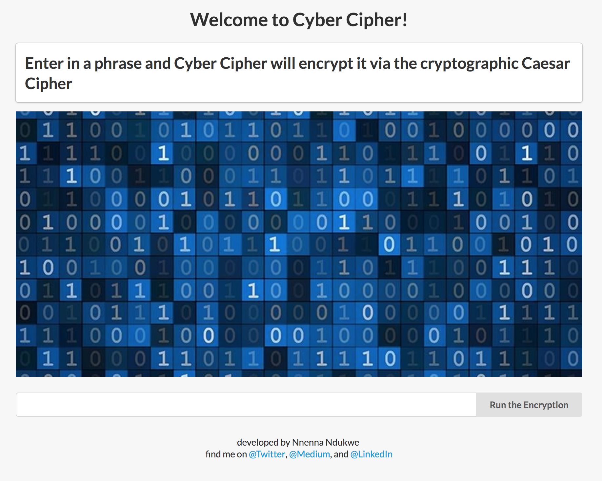

# Cyber Cipher
### A cryptographic Caesar Cipher Encryption Program
Cyber Cipher is designed to take in a string of characters a user enters in in order to return an encrypted version of the string.
> Here's the live app site: https://cybercipher.herokuapp.com

> Learn more about this cryptographic algorithm here https://en.wikipedia.org/wiki/Caesar_cipher
 

### Requirements
- Python 2.7 / 3+
- Jinja2 (Templating Engine)
- Flask
### How To Run
- Git clone repository
- Install above requirements one at a time with `pip install insert-name-here`
- In your Terminal, run `python main.py`
### Technologies Utilized
1. Python 3.6+
2. Flask
3. Jinja2 as an HTML templating engine
4. HTML5
5. CSS3
6. Semantic UI framework
7. Heroku for deployment & Procfile
8. Pipenv for build pack
### Why I Built The Cyber Cipher
I was looking for interesting projects to build where I could set up a server and focus more on backend than frontend code. I wanted to utilize modern technologies while excluding unnecessary build tools for the sake of simplicity and thus, lack of necessity.
### What I'm Learning While Building This Program
- Software Architecture matters more than any other aspect of building an app or program that implements client and server-side development.
- Do not assume the data structure of what certain methods from imported packages and/or modules will return. Read the documentation for interpreting/ingesting such data.
### Impending Feature Additions
1. Docker container implementation
2. Additional cryptographic cypher implementations with sidebar menu of options
3. Information / Definition glossary page as tab in sidebar menu of cipher options
4. Hot reloading for server in order to reduce amount of server kills from errors
### Current Limitations to the Program
- Users cannot enter in special characters (non English alphabetic characters into encryption  input field without causing an error in the program
- Users must enter in a string with no whitespace as a result of KeyError
- No testing for this program has occurred on machines with other operating systems
- Lack of error handling in order to reroute program and prevent server crashes
- Lack of rerouting and input value clearing subsequent to running the encryption program successfully

